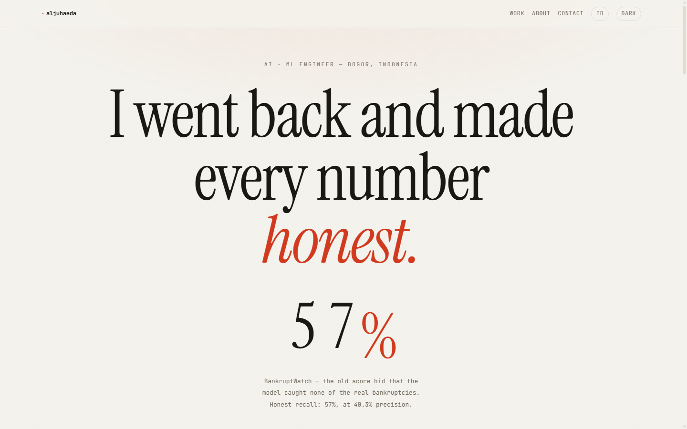

# Zul Iflah Al Juhaeda — Portfolio

[](https://aljuhaeda.com)

Personal portfolio at **[aljuhaeda.com](https://aljuhaeda.com)**. Eight machine-learning
and software projects — text classifiers, a bankruptcy-risk model, a breast-ultrasound
CNN, a Flutter prayer-times app, a GIS dashboard, a property-management system — most of
them revisited until the reported numbers were honest. Published NLP research behind it.

## Getting started

Requires Node.js 20.9+.

```bash
git clone https://github.com/aljuhaeda/portfolio-website.git
cd portfolio-website
npm install
npm run dev
```

Verify a change:

```bash
npm run build      # next build (Turbopack)
npm run lint       # eslint
npm test           # node --test — MDX + projects data tripwires
```

## Where things live

| What | Where |
|---|---|
| Identity, links, the paper, studies, skills | `src/lib/content.ts` |
| Project list + per-project rework data | `src/lib/projects.ts` |
| Case-study bodies (Markdown) | `src/app/work/projects/*.mdx` |
| UI strings, EN + ID | `src/i18n/en.ts`, `src/i18n/id.ts` |
| Design tokens (colour, type scale) | `src/styles/tokens.css` |
| Components | `src/components/*` (co-located `.module.css`) |
| OG share image | `src/app/og/route.tsx` (Node runtime) |

Adding a project: drop an `.mdx` file in `src/app/work/projects/` and add a matching
entry to `EXTRAS` in `src/lib/projects.ts` (the build throws if one is missing).

## Stack

- **Next.js 16**, App Router, React 19, Turbopack
- `next-mdx-remote` for case studies, `gray-matter` for frontmatter
- Hand-built design system — CSS Modules, no component library
- `next/font`: Instrument Serif, Newsreader, JetBrains Mono
- Cookie-based EN/ID i18n; light-default theme with a toggle
- Deployed on Vercel (push to `main` ships)

## History

The site was originally scaffolded from Once UI's [Magic Portfolio](https://github.com/once-ui-system/magic-portfolio)
template (CC BY-NC 4.0 — see [LICENSE](LICENSE)). It was rebuilt from scratch in
2026 — the template and its component library were removed entirely; all content,
layout, and styling are original.
